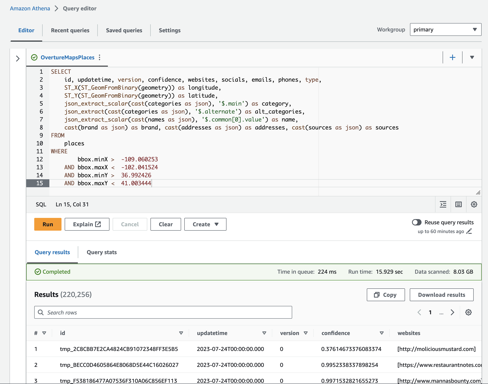
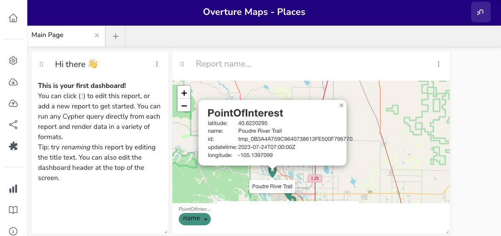

# overture-graph 

Working with the [Overture Maps](https://overturemaps.org/) data in Neo4j.

## Querying Overture Maps Data With AWS Athena



```SQL
CREATE EXTERNAL TABLE `admins`(
  `id` string,
  `updateTime` string,
  `version` int,
  `names` map<string,array<map<string,string>>>,
  `adminLevel` int,
  `maritime` string,
  `subType` string,
  `localityType` string,
  `context` string,
  `isoCountryCodeAlpha2` string,
  `isoSubCountryCode` string,
  `defaultLanugage` string,
  `drivingSide` string,
  `sources` array<map<string,string>>,
  `bbox` struct<minX:double,maxX:double,minY:double,maxY:double>,
  `geometry` binary)
PARTITIONED BY (
  `type` string)
STORED AS PARQUET
LOCATION
  's3://overturemaps-us-west-2/release/2023-07-26-alpha.0/theme=admins'


MSCK REPAIR TABLE `admins`
```

```SQL
CREATE EXTERNAL TABLE `buildings`(
  `id` string,
  `updateTime` string,
  `version` int,
  `names` map<string,array<map<string,string>>>,
  `level` int,
  `height` double,
  `numFloors` int,
  `class` string,
  `sources` array<map<string,string>>,
  `bbox` struct<minX:double,maxX:double,minY:double,maxY:double>,
  `geometry` binary)
PARTITIONED BY (
  `type` varchar(8))
STORED AS PARQUET
LOCATION
  's3://overturemaps-us-west-2/release/2023-07-26-alpha.0/theme=buildings'


MSCK REPAIR TABLE `buildings`

```

```SQL
CREATE EXTERNAL TABLE `places`(
  `id` string,
  `updateTime` string,
  `version` int,
  `names` map<string,array<map<string,string>>>,
  `categories` struct<main:string,alternate:array<string>>,
  `confidence` double,
  `websites` array<string>,
  `socials` array<string>,
  `emails` array<string>,
  `phones` array<string>,
  `brand` struct<names:map<string,array<map<string,string>>>,wikidata:string>,
  `addresses` array<map<string,string>>,
  `sources` array<map<string,string>>,
  `bbox` struct<minX:double,maxX:double,minY:double,maxY:double>,
  `geometry` binary)
PARTITIONED BY (
  `type` varchar(5))
STORED AS PARQUET
LOCATION
  's3://overturemaps-us-west-2/release/2023-07-26-alpha.0/theme=places'


MSCK REPAIR TABLE `places`


```

```
CREATE EXTERNAL TABLE `transportation`(
  `id` string,
  `updateTime` timestamp,
  `version` int,
  `level` int,
  `subType` varchar(4),
  `connectors` array<string>,
  `road` string,
  `sources` array<map<string,string>>,
  `bbox` struct<minX:double,maxX:double,minY:double,maxY:double>,
  `geometry` binary)
PARTITIONED BY (
  `type` varchar(9))
STORED AS PARQUET
LOCATION
  's3://overturemaps-us-west-2/release/2023-07-26-alpha.0/theme=transportation'


MSCK REPAIR TABLE `transportation`
```


All places in bounds of Clark County, Nevada

```SQL

SELECT
    id, updatetime, version, confidence, websites, socials, emails, phones, type,
    ST_X(ST_GeomFromBinary(geometry)) as longitude,
    ST_Y(ST_GeomFromBinary(geometry)) as latitude,
    json_extract_scalar(cast(categories as json), '$.main') as category,
    json_extract(cast(categories as json), '$.alternate') as alt_categories,
    json_extract_scalar(cast(names as json), '$.common[0].value') as name,
    json_extract(json_array_get(cast(sources as json), 0), '$.dataset') as source_dataset,
    json_extract(json_array_get(cast(sources as json), 0), '$.recordid') as source_recordid,
    json_extract(json_array_get(cast(addresses as json), 0), '$.freeform') as street_address,
    json_extract(json_array_get(cast(addresses as json), 0), '$.locality') as locality,
    json_extract(json_array_get(cast(addresses as json), 0), '$.postcode') as postcode,
    json_extract(json_array_get(cast(addresses as json), 0), '$.region') as region,
    json_extract(json_array_get(cast(addresses as json), 0), '$.country') as country
FROM
    places
WHERE
        bbox.minX >  -115.896925
    AND bbox.maxX <  -114.042819
    AND bbox.minY >  35.001857
    AND bbox.maxY <  36.853662
```


Transportation theme for bounds of Clark County, NV

```SQL
SELECT
    id, updatetime, version, subtype, connectors, type, 
    ST_GeomFromBinary(geometry) as wkt,
    coalesce(try(ST_X(ST_GeomFromBinary(geometry))), 0) as longitude,
    coalesce(try(ST_Y(ST_GeomFromBinary(geometry))), 0) as latitude,
    json_array_get(cast(connectors as json), 0) as connector_from,
    json_array_get(cast(connectors as json), 1) as connector_to
FROM
    "transportation"
WHERE
        bbox.minX >  -115.896925
    AND bbox.maxX <  -114.042819
    AND bbox.minY >  35.001857
    AND bbox.maxY <  36.853662
```

Admin theme for bounds of USA

```SQL
SELECT
    *,  ST_GeomFromBinary(geometry)
FROM
    "admins"
WHERE
        bbox.minX >  -171.791110603
    AND bbox.maxX <  -66.96466
    AND bbox.minY >  18.91619
    AND bbox.maxY <  71.3577635769
```

### Resources

* https://feyeandal.me/blog/access_overture_data_using_athena
* https://github.com/OvertureMaps/data/blob/main/athena_setup_queries.sql#L77
* https://docs.aws.amazon.com/athena/latest/ug/extracting-data-from-JSON.html
* https://trino.io/docs/current/functions/geospatial.html
* https://anthonylouisdagostino.com/bounding-boxes-for-all-us-counties/


## Notebooks

`/notebooks` contains Python notebooks for working with the overture data.

This project uses Poetry to manage dependencies and python virtual environments. After cloning this repository, be sure [Poetry is installed](https://python-poetry.org/) then run:

```
poetry install
```

To add dependecies:

```
poetry add foobar
```

Update `.env` with any relevant environment variables, then to start Jupyter:

```
poetry shell
jupyter notebook
```

## Graph Models

### Places

### Admins

### Transportation

### Buildings

## Visualization

### Neo4j Bloom

### Neodash

