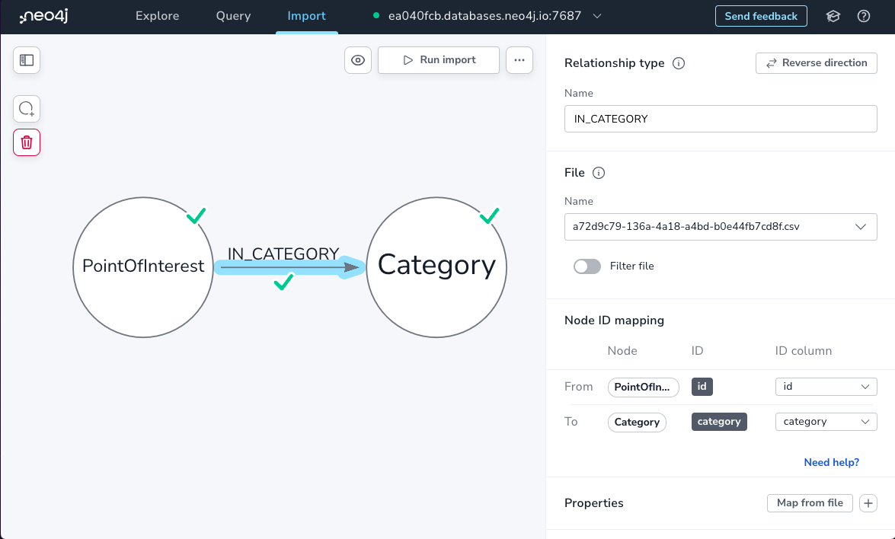
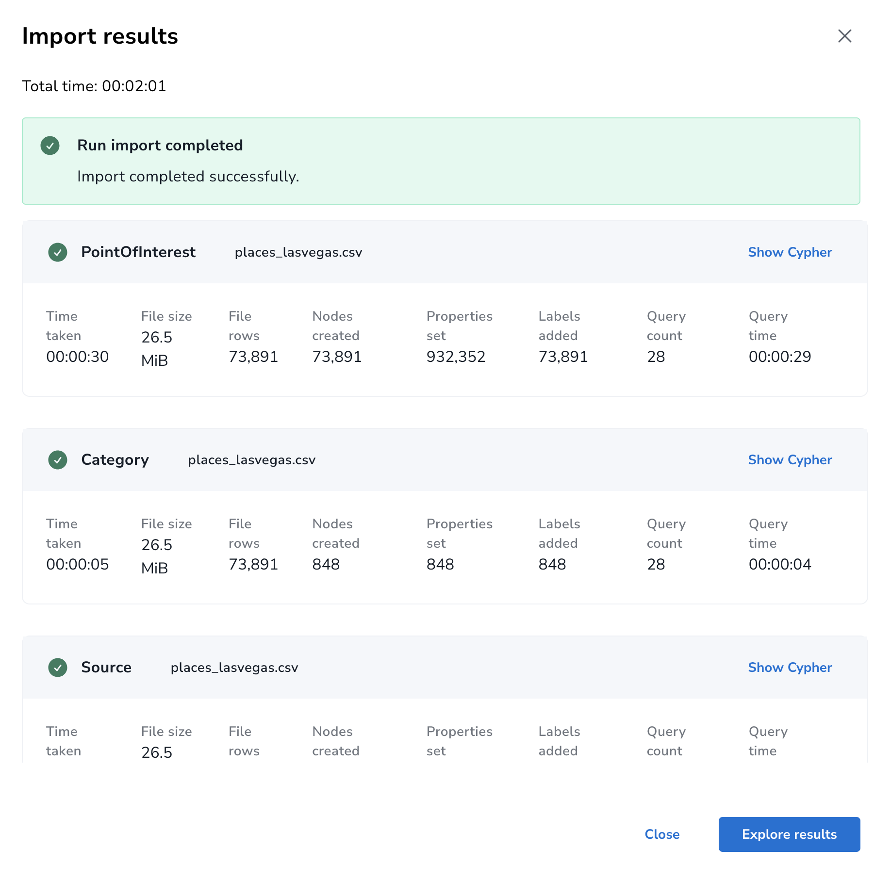

# Import


## Neo4j Aura's Import





## Transportation

```
 csvclean -b transportation_lasvegas.csv
```

```cypher
CREATE CONSTRAINT FOR (s:Node) REQUIRE s.id IS UNIQUE
```


```cypher
LOAD CSV WITH HEADERS FROM "file:///transportation_lasvegas_out.csv" AS row
MERGE (n:Node {id: row.id})
ON CREATE SET
    n.wkt = row.wkt,
    n.subtype = row.subtype,
    n.road = row.road,
    n.updateTime = row.updatetime,
    n.type = row.type,
    n.version = row.version,
    n.connectors = row.connectors

RETURN COUNT(*)
```

## Places

_TODO: graph data model diagram_

```Cypher
CREATE CONSTRAINT FOR (p:PointOfInterest) REQUIRE p.id IS UNIQUE;
CREATE CONSTRAINT FOR (c:Category) REQUIRE c.name IS UNIQUE
```

```Cypher
LOAD CSV WITH HEADERS FROM "file:///places_co.csv" AS row
WITH row, apoc.text.regexGroups(row.wkt, '[-]?\d+.\d+') AS coords
WITH * LIMIT 1000
MERGE (p:PointOfInterest {id: row.id})
ON CREATE SET
   p.location = point({latitude: toFloat(coords[1][0]), longitude: toFloat(coords[0][0])})
  // TODO: parse addresses
  // "[{locality=Castle Rock, postcode=80104-1741, country=US, region=CO, freeform=718 Wilcox St}]"
  // TODO: parse names
  // "names": "{common=[{value=Colorado Tax Center, language=local}]}",
  // TODO: parse categories 
  // "categories": "{main=trusts, alternate=[financial_service, professional_services]}",
  // TODO: parse brand
  // "brand": "{names=null, wikidata=null}"
  // TODO: parse_source
  // [{recordid=1815219282110252, property=, dataset=meta}]
```

Using apoc.load.json

```cypher
CALL apoc.load.json("file:///places_co.json") YIELD value
//WITH value LIMIT 10
WITH value, 
    apoc.text.regexGroups(value.wkt, '[-]?\d+.\d+') AS coords,
    apoc.json.path(value.addresses, "$") AS addresses,
    apoc.json.path(value.categories, "$") AS categories,
    apoc.json.path(value.names, "$.common[0].value") AS name,
    apoc.json.path(value.sources, "$") AS sources

// PointOfInterest
MERGE (p:PointOfInterest {id: value.id})
ON CREATE SET
    p.name = name,
    p.location = point({latitude: toFloat(coords[1][0]), longitude: toFloat(coords[0][0])})

// Category
MERGE (c:Category {name: coalesce(categories.main, "")})
MERGE (p)-[:IN_CATEGORY {main: True}]->(c)
FOREACH ( alt IN categories.alternate | 
    MERGE (altc:Category {name: alt}) 
    MERGE (p)-[:IN_CATEGORY {main: False}]->(altc)  
)

// Source
FOREACH (source IN sources | 
    MERGE (s:Source {dataset: source.dataset})
    MERGE (p)-[:FROM_SOURCE {recordid: source.recordid}]->(s)
)

// Addresses

FOREACH (addr IN addresses | 
    CREATE (a:Address)
    SET a += addr
    CREATE (p)-[:HAS_ADDRESS]->(a)
)

RETURN COUNT(*)
```